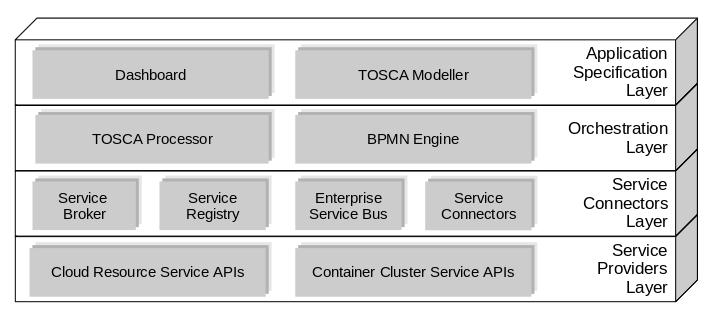

# TORCH: a TOSCA-based orchestrator of multi-cloud resources

This repo contains code accompanying the paper "TORCH: a TOSCA-based orchestrator of multi-cloud resources". It includes the services and the TOSCA application specification to run the same experiments described in the paper.

## Framework Architecture

The framework is made by several components that interact with each other to accomplish the deployment of a TOSCA-compliant application description. The overall architecture is shown hereby:

Refer to the paper for details about each component, the implementation and the description of the provisioning process.

## Description

The codebase is organised as it follows:

* **dashboard** : the folder contains the code to run the Dashboard component, which incorporates also the TOSCA Modeller and the TOSCA Processor components

* **bpmn-plans** : the folder contains the BPMN plan definitions that should be deployed to the BPMN Engine (i.e. Flowable)

* **service-binding** : the folder contains the code to run the Service Broker, the Service Registry, the Enterprise Service Bus and the Service Connectors

* **examples** : the folder contains the examples presented in the original paper

## Requirements

In order to run TORCH a working installation of the Flowable BPMN Engine is required. Please, refer to the [Flowable documentation](https://flowable.com/open-source/docs/) for the installation instructions.

## Instructions

In order to start the framework you should:

* Deploy the [BPMN Plans](bpmn-plans) on Flowable
* Start the [Service Binding components](service-binding)
* Start the [Dashboard](dashboard)

Finally, from the Dashboard, you can upload one of the templates in [examples](examples), or create your own application, and launch the deployment process.

## Contact

To ask questions or report issues, please open an issue on the [issues tracker](issues).